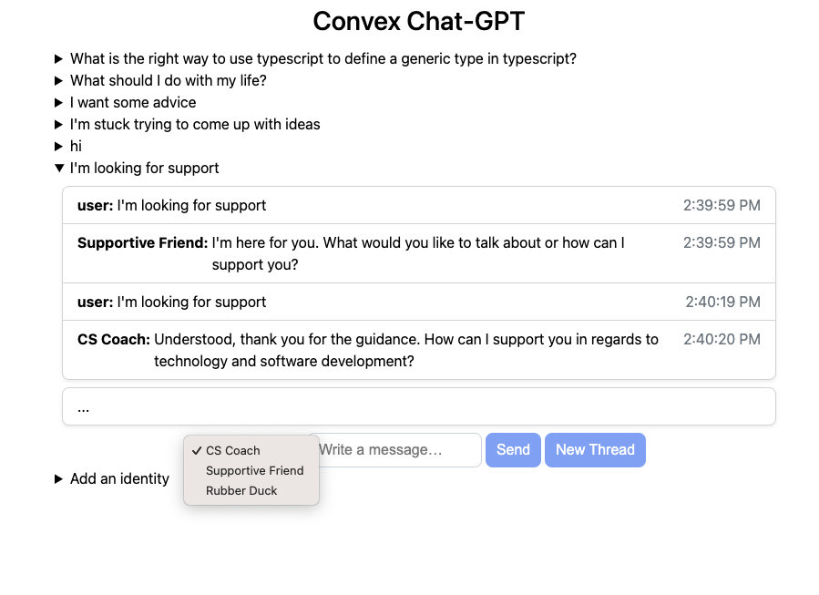

# ChatGPT Convex demo



This example app demonstrates how to use the
[OpenAI ChatGPT API](https://platform.openai.com/docs/guides/chat) with
[Convex](https://convex.dev) to implement a chat. Convex stores the messages and
runs server-side functions to interact with OpenAI.

Features:
- You can chat and get responses from the Chat GPT api.
- You can start new threads to reset your conversation with Chat GPT.
- You can specify what the chat identity is, and change it mid-thread.
- You can make new identities.
- Inputs are checked for offensive input using the moderation api.

This uses [Convex actions](https://docs.convex.dev/using/actions) to make
requests to OpenAI's API.

## Setting up

Run:

```
npm install
npx convex init
```

This will guide you through making a Convex project.

Create a free account on openai.com and create your
[OpenAI API secret key](https://platform.openai.com/account/api-keys), and set it as
an [environment variable](https://docs.convex.dev/using/environment-variables)
with the name `OPENAI_API_KEY` via the
[Convex dashboard](https://dashboard.convex.dev/).


## Running the App

Run:

```
npm run dev
```

Then visit [localhost:3000](http://localhost:3000).

## Identities

You can add identities to talk to. I added:

**Rubber Duck**
> You are curious and respond with helpful one-sentence questions.

**Supportive Friend**
> You are a supportive and curious best friend who validates feelings and experiences and will give advice only when asked for it. You give short responses and ask questions to learn more.

**CS Coach**
> You are a highly technically trained coach with expertise in technology and best practices for developing software. Respond with concise, precise messages and ask clarifying questions when things are unclear.
